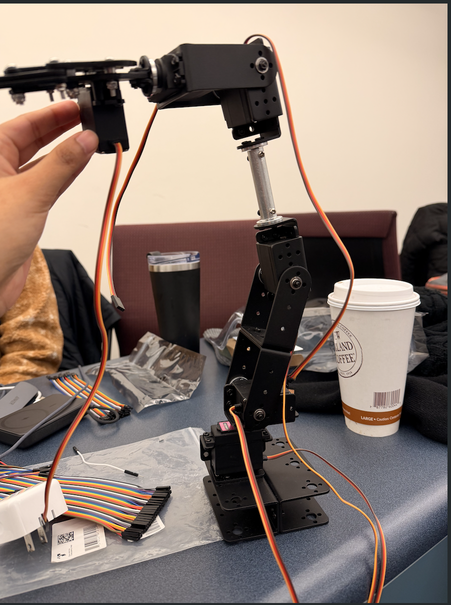
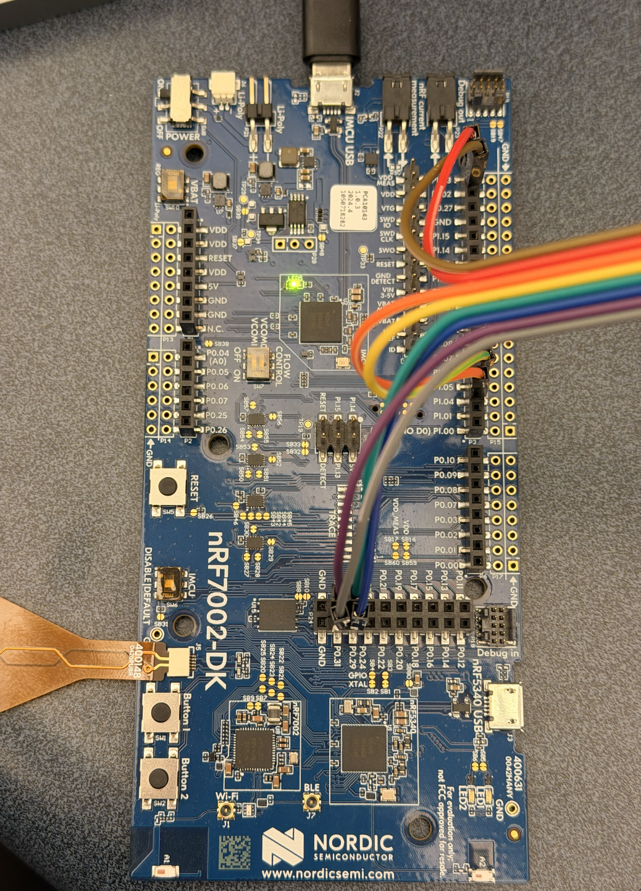

# Hack-A-Thing - IoT Hackathon

Our Project - An Automated Robotic Arm Control System

Team Members:
- Sai Jayakar Vanam, Sania Anwar, Rithvik Shivva, Umar Makki

This project implements a smart robotic arm that can be controlled using multiple input methods. A joystick provides smooth, real-time movement, a keypad enables precise gripper control, and an IR sensor adds collision detection for safer operation. 
All components are coordinated by the Nordic nRF7002-DK, acting as the central controller.

  
  

  

# Hardware Components

1. Nordic nRF7002-DK (Control Board)
The board processes inputs from the joystick, keypad, and IR sensor, and converts them into precise control signals for the servo motors. Its flexible GPIO and high-resolution ADC enable smooth real-time control.

2. Keypad Interface
The keypad provides accurate and intentional control over the robotic gripper. Different buttons allows the user to open and close the gripper, reset the arm to a home position, or trigger automated actions.

3. IR Sensor
The IR sensor enables the robotic arm to detect nearby objects and avoid collisions. By continuously monitoring the environment, it adds an autonomous safety layer that prevents unintended contact and supports smarter object interaction when it’s being used.

5. Joystick
The joystick allows smooth and intuitive control of the robotic arm’s movement. Its X and Y axes control motor positions, and the built-in button lets users switch between motors.

## Robotic Arm Integration
Joystick Control Scheme: 
- X/Y axes control selected motor position
- Button press cycles through 6 motors sequentially
- Real-time ADC sampling at 10Hz

Keypad Functions:
- Button 1: Open gripper
- Button 2: Close gripper
- Button 3: Reset to home position
- Button A: Execute automated sequence

IR Sensor:
- Object presence verification

